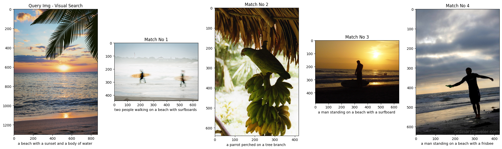
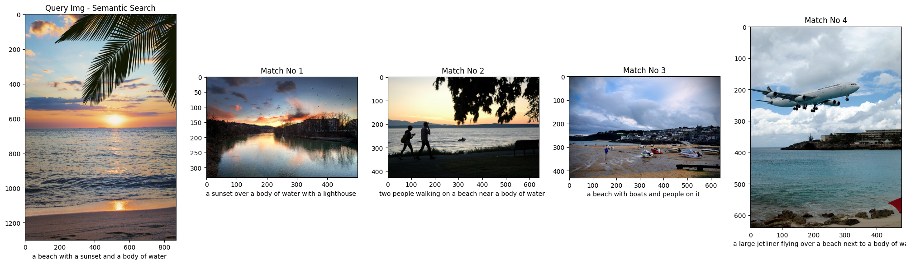
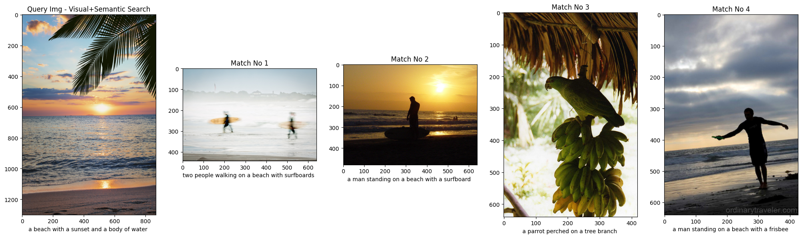
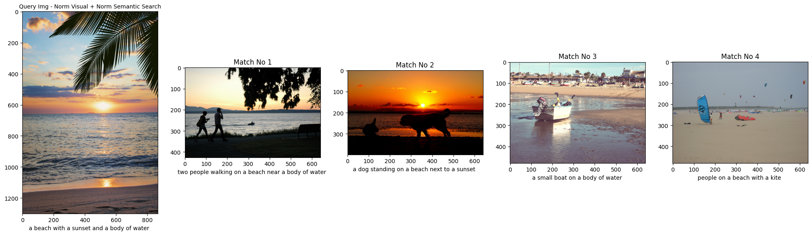
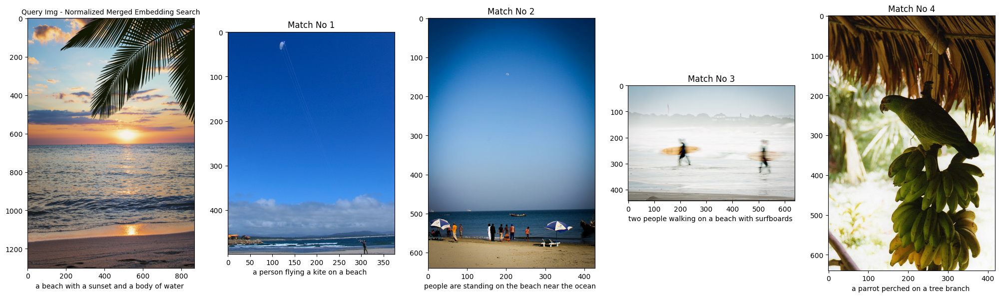

# Enhancing Image Search with Fusion of Visual and Textual Information

## Overview  
This project improves traditional image search by combining **visual embeddings** (from CNN models) with **semantic embeddings** (from generated image captions).  
The fusion of these two modalities creates richer representations, leading to more accurate and context-aware image retrieval.

---

## Main Components  

### 1. Dataset  
- **MS COCO** dataset (10K images across 80 classes).  
- Captions are generated dynamically to ensure consistency between dataset and query images.  

### 2. Visual Embeddings  
- Extracted using pre-trained CNN models:  
  - **ResNet50**  
  - **EfficientNet**  

### 3. Image Captioning  
- Generated using a **Visual Encoder-Decoder**:  
  - Vision Transformer (**ViT**) as encoder  
  - **GPT-2** as decoder  

### 4. Semantic Embeddings  
- Extracted from captions using:  
  - **Sentence-BERT**  
  - **Universal Sentence Encoder (USE)**  

### 5. Fusion Methods  
Three approaches to combine visual and semantic embeddings:  
1. Concatenation (raw)  
2. **Pre-normalized fusion** (normalize separately, then concatenate)  
3. **Post-normalized fusion** (concatenate, then normalize)  

### 6. Search Query Pipeline  
- Generate fused embedding of query image.  
- Compare with dataset embeddings using **cosine similarity**.  
- Return top matches.  

### 7. Evaluation  
- **Quantitative**: Precision and Recall on single-label test images.  
- **Qualitative**: Visual comparison of retrieved images.  

---

## Qualitative Results  

Below are examples showing retrieved images for different an image query with a caption:  **a beach with a sunset and a body of water**

### 1. Image Search via Visual Embeddings  
  

### 2. Image Search via Caption Embeddings  
  

### 3. Image Search via Concatenated Fusion (without embedding normalization)  
  

### 4. Image Search via Pre-normalized Fusion (Visual + Caption)  
  

### 5. Image Search via Post-normalized Fusion (Visual + Caption)  
  

## Conclusion  
The project demonstrates that combining **visual and semantic features** yields better image retrieval compared to using either modality alone.  
**Pre-normalized fusion** is the most effective approach, but future work can explore neural-network-based fusion for further improvements.  
